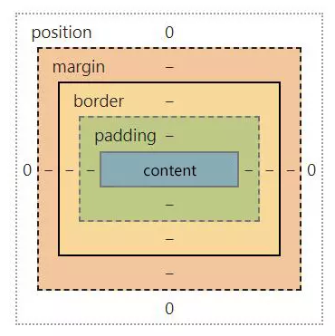

当浏览器对一个网页文档进行布局（layout）的时候，其渲染引擎会根据标准之一的 CSS 基础框盒模型（CSS basic box model），将所有元素表示为一个个矩形的盒子（box）。CSS 决定这些盒子的大小、位置以及属性（例如颜色、背景、边框尺寸…）。

盒模型由 content（内容）、padding（内边距）、border（边框）、margin（外边距）四部分组成。

前端的盒模型有两种，分别是W3C盒模型盒IE盒模型，它们唯一的区别就是元素的宽度。

IE盒模型的宽度为`width=content+padding+border`

W3C盒模型的宽度为`width=content`
> 后来W3C在CSS3中新增了box-sizing的样式，属性包含content-box和border-box；content-box就是默认的样式（W3C盒模型），border-box（IE盒模型）是width包含了content+padding+boder。
